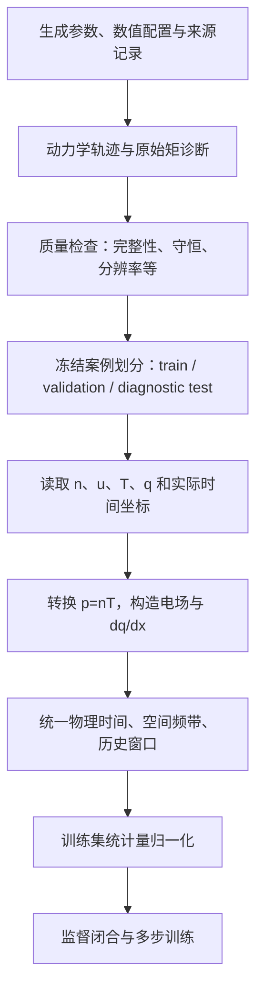
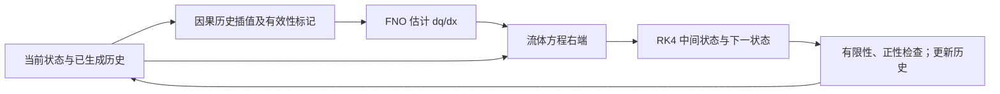
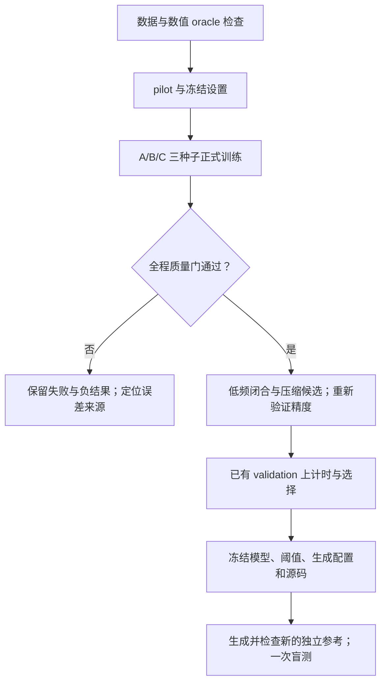

# 项目逻辑与代码地图

[返回学习路线](README.md) · [上一篇：背景概念](01_BACKGROUND_zh-CN.md) · [下一篇：任务定义](03_TASK_DEFINITIONS_zh-CN.md)

本篇回答三个问题：为什么仓库中有这么多模型；当前研究按什么逻辑推进；阅读代码应从哪里进入。
这里按研究问题组织，不要求新成员先记住每个历史阶段编号。

## 1. 总目标与当前切入点

完整动力学模型演化 `f(x,v,t)`，保留了丰富的速度空间信息，但计算和存储代价较高。
我们希望用较少的计算获得所需预测，同时证明重要的物理行为没有因此丢失。

这个目标可以沿多条路线实现。早期研究直接预测完整相空间分布，后续研究逐渐转向低阶矩场。
当前 Round 11 保留密度、流速、压力与电场的演化方程，学习其中缺失的热流梯度。
减少变量数量提供了降低成本的可能，但不自动保证模型准确或端到端加速。

## 2. 先区分四种模型任务

| 路线 | 一次模型调用读什么 | 一次调用输出什么 | 时间怎样前进 | 主要研究问题 |
|---|---|---|---|---|
| Snapshot 分布代理 | 初始参数、查询时间、坐标 | 当前时刻完整 `delta_f(x,v)` | 可直接查询不同时间 | 参数到分布快照的重建是否准确？ |
| 分布 Stepper/Rollout | 当前预测分布、条件信息 | 下一时刻的分布 | 模型递归调用 | 分布误差如何随递归累积？ |
| 低阶状态宏步代理，Round 10 | 历史 `M0,M1,M2,E` 和条件 | 下一个宏步的状态残差 | 网络跨越一个较大 `DeltaT` | 历史能否支持较大步长的保守场预测？ |
| 流体热流闭合，Round 11 | 当前/历史 `n,u,p,E` 与条件 | 当前 `g=dq/dx` | RK4 用闭合项推进已知方程 | 有限低阶历史能否改善长期闭合精度？ |

Snapshot 与 Stepper 的正式缓存网格是早期分支的约定，不能直接套到 Gkeyll 矩场数据。
Round 10 的 `M2` 是二阶原始矩，Round 11 的 `p` 是压力，二者也不能直接互换。
论文或报告中出现“FNO”，必须继续问它在这张表中承担哪一种任务。

早期 x-v 模型的 mean anchor 只混合分布扰动的空间平均部分；它不是热流闭合，也不是 Round 11 的历史机制。
旧模型的 `t=0..15` 指标、PIC 热流分支的 `t=60` 指标，以及当前 `t=80` 的要求，属于不同实验范围。

## 3. 数据从哪里来，为什么有不同数据族

| 数据族 | 数值路线与用途 | 新成员需要注意 |
|---|---|---|
| 历史 PIC 分布缓存 | 用计算粒子采样分布，用于已有 Snapshot/Rollout checkpoint | 精确抽样缓存与 M0/M2 保守压缩缓存不可静默替换 |
| 非线性 CUDA-PIC 数据 | 粒子模拟及其矩诊断，用于较早的热流闭合实验 | 粒子采样噪声会影响高阶矩和求导，需按该分支的合同使用 |
| Gkeyll `continuum_v1` | 在相空间网格上求解动力学方程，提取矩与热流 | 当前 Round 10/11 的参考体系；有独立 QC、时间坐标与划分 |

两条动力学数值路线都近似同类物理过程，但离散误差、噪声和诊断方法不同。
Gkeyll 的连续体 Vlasov 与 DG 基函数支持见
[官方说明](https://gkeyll.readthedocs.io/en/latest/)。
“使用另一个求解器”不能自动消除所有参考误差；需要检查分辨率、守恒和数据转换。

当前数据流是：

图中每个转换都可能引入错误。例如把 `T` 当成 `p`、把名义帧间隔当成真实时间、
对归一化空间坐标求导却漏掉 `K`，都可能让网络学到错误标签。
因此我们先检查数据与方程之间的一致性，再讨论网络容量。

## 4. 一次 Round 11 自主推进发生什么

从给定初态 `U0=(n,u,p,E)` 开始。初态之前没有观测历史，因此用初态填充，
并通过有效性标记告诉模型哪些槽并非实际过去时刻的状态。

在当前时刻，历史模块按物理时间挑选近期状态，FNO 估计热流梯度。
流体右端把它代入压力方程，RK4 计算下一状态，接受后的状态被写入历史。
这个循环一直持续到终点或产生物理失败记录。

RK4 不是每步只调用一次右端。默认设置每个流体步调用四次闭合，
其中两次位于半步时间，但使用不同的中间状态。中间时刻的历史也必须因果构造。
后续“降低闭合调用频率”改变了这个行为，所以必须重新验证精度与稳定性。

参考轨迹只在循环外用于打分；它不是部署循环中的纠错器。
可以对照[自主推进因果性测试](../../tests/test_history_closure_round11.py)：
把未来参考状态和热流设成 NaN 后，从初态出发的预测应保持一致。

## 5. 为什么先做 oracle，再训练网络

Oracle 在这里表示把动力学参考的、随时间变化的真实闭合标签交给流体求解器。
它有意使用真实标签，目的是检查数值链路；它不是可部署模型，也不是机器学习准确度结果。

如果连参考闭合都无法让低阶求解器接近参考矩场，就应先检查：

- 变量与热流定义是否相同，符号、质量因子和 `1/2` 是否一致；
- 空间导数是否使用正确波数，滤波是否丢失了待评价的信号；
- 实际时间坐标、插值、步长与 RK 中间时刻是否一致；
- 数值精度和方程形式是否造成额外误差。

换更大的 FNO 并不能修复错误的标签或求解器合同。
Oracle 通过说明这套离散设置具备重现所检查参考轨迹的能力；
**它既不证明只看低阶状态就能推断真实闭合，也不证明学习到的闭合在偏离参考轨迹时可靠。**
滤波后的非线性方程还可能出现额外离散误差，不能凭“取矩在连续层面成立”跳过这项检查。

## 6. 训练为什么分为两个阶段

### 先学习参考状态上的闭合

监督训练把参考低阶状态或历史作为输入，用相同时刻的参考 `g` 作为标签。
它回答“在已知正确的状态附近，网络能否估计所需闭合”。
这是必要的基础检查，但网络部署后会逐步看到自己的偏差状态。

### 再让网络承担连续推进后的结果

多步训练将网络放进可微分求解器中，比较整个短窗口内的预测状态与参考状态。
损失通过多次闭合调用和推进步骤回传，网络因而受到“这次闭合怎样影响后续状态”的约束。

Round 11 在有梯度窗口前先自由推进一段时间刷新历史；这个刷新段不保留梯度，
正式损失窗口内部则不切断梯度。它仍然是从参考轨迹抽取的训练窗口，
不能等同于从物理初态一路自由运行到 `t=80` 的最终验证。

监督误差、多步训练损失、短窗验证分数和全程质量门是不同层次的证据。
模型在某一层改善，不保证另外几层同步改善。

## 7. A/B/C 对照到底要回答什么

| 对照 | 保持一致的部分 | 改变的输入信息 | 想检验的问题 |
|---|---|---|---|
| A 与 B | 数据划分、主干、求解器、预算与尺度信息 | 当前状态变为有限历史 | 近期历史是否带来可重复的闭环收益？ |
| B 与 C | 历史跨度、主干及其余设置 | 是否显式提供初始 `alpha` | 已有历史之外，初始幅度标签是否带来额外收益？ |
| 同一 arm 的三个种子 | 初始监督 checkpoint 和科学配置 | 采样时间与样本顺序等随机性 | 收益是否依赖一次幸运训练？ |

当前 A/B/C 都提供 `K`，因此不能通过它们比较来证明“去掉 K 必然失败”。
当前三个种子共享原监督初始化，也不能称为三个完全独立初始化。
如果要研究这些问题，需要另开具有明确控制变量的新对照。

## 8. 为什么先要求准确，再讨论更快

一次网络前向很快，只说明一个组件便宜。完整成本还包含 RK4 多次调用、历史处理、
FFT、数据传输、模型加载和结果写盘。应分别记录这些范围，比较相同硬件、案例、终止时间与输出要求。
三矩模型只输出矩场；它的耗时不能被描述成“以相同精度生成完整分布的耗时”。

## 9. 已有结论、假设和实时状态分别在哪里

本学习材料以首个公开代码版本 `b56ae84` 中的 Round 11 定义为基础。
该版本的[执行记录](../experiments/LANDAU_CLOSURE_ROUND11_EXECUTION_2026-09-07_zh-CN.md)
记录了已完成的 oracle 检查和未通过精度门的 pilot；不能据此声称正式闭合已经达标或实现加速。

| 信息类型 | 去哪里查 | 怎样解读 |
|---|---|---|
| 稳定的任务定义 | 本组文档、[协议](../experiments/LANDAU_CLOSURE_ROUND11_PROTOCOL_zh-CN.md) | 理解问题、变量、流程与约束 |
| 某次冻结配置 | 运行目录的 `config.json`、checkpoint、源码哈希 | 精确复现该次运行，不把默认模板当成实际配置 |
| 已保存的实验结论 | 对应阶段的报告与逐案例指标 | 核对数据范围、比较集合与失败案例 |
| 正在运行的进度 | 共享服务器 `results/continuum_v1_closure_round11/RUN_STATUS.md` | 运行状态会变化，不能当作冻结结论 |

`configs/...pilot.json` 是起点模板；控制器会生成正式训练配置并应用 overrides。
生成配置中的 `t_end=60` 默认值也不等于所有已处理轨迹的实际终点。
一切需要精确复现的长度、时刻、路径和参数，都应回到实际轨迹与运行记录核对。

## 10. 阅读代码的最短路线

以下链接均指向当前维护代码。先看函数的输入输出和注释，再看内部细节。

| 阅读顺序 | 文件与关键入口 | 先找的答案 |
|---|---|---|
| 1 | [continuum_v1.py](../../src/landau_surrogate/data/continuum_v1.py)，`load_continuum_case` | HDF5 通道如何变成 `n,u,p` 和 `dq/dx`？ |
| 2 | [continuum_history.py](../../src/landau_surrogate/data/continuum_history.py)，`history_offsets`、`supervised_history` | 历史取哪些物理时刻，初始缺失历史怎样表示？ |
| 3 | [history_closure.py](../../src/landau_surrogate/models/history_closure.py)，`HistoryClosureFNO.forward` | A/B/C 怎样保持输入大小一致，如何施加输出约束？ |
| 4 | [multimoment_1d.py](../../src/landau_surrogate/fluid/multimoment_1d.py)，`fluid_rhs_ampere` | 预测闭合进入哪一条方程？ |
| 5 | [history_closure_1d.py](../../src/landau_surrogate/fluid/history_closure_1d.py)，`advance_history` | 何时调用网络、接受状态、更新历史？ |
| 6 | [continuum_history_closure.py](../../src/landau_surrogate/training/continuum_history_closure.py)，`training_rollout`、`full_validation` | 训练与正式验证读取的信息有什么差别？ |
| 7 | [summarize_round11_history.py](../../scripts/summarize_round11_history.py)，`interval_metrics`、`acceptance` | 指标和质量门怎样计算？ |
| 8 | [run_round11_closure_postquality.py](../../scripts/run_round11_closure_postquality.py) | 为什么质量门失败时不能进入加速与盲测？ |

历史 x-v 路线从 [snapshot 推理](../../src/landau_surrogate/inference/snapshot.py)和
[rollout 推理](../../src/landau_surrogate/inference/rollout.py)进入；
Round 10 则先读[宏步协议](../experiments/LANDAU_MACROSTEP_ROUND10_PROTOCOL_zh-CN.md)。
研究当前闭合时不需要先阅读 `reference/upstream/` 的全部旧代码。
