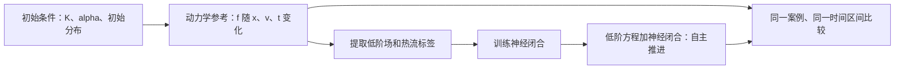

# 新成员学习路线

这组文档面向第一次接触项目、可能还没有等离子体或神经算子背景的成员。
你只需要先了解数组、函数、导数和积分的基本含义；不需要一开始就读完整篇论文或启动训练。

项目的研究问题是：**能否用比完整动力学模拟便宜的模型，准确预测 Landau 阻尼中的长期非线性演化？**
当前 Round 11 重点研究“保留低阶流体方程，让神经网络估计缺失的热流梯度”。
能训练出网络、能运行到终点、预测准确、实际更快，是四件需要分别验证的事。

可以先浏览[关键结果与看图指南](../results/KEY_RESULTS_zh-CN.md)，带着具体图表再学习下面的概念。
[checkpoint 指南](../results/CHECKPOINTS_zh-CN.md)提供无需训练数据的第一次 CPU 推理练习。

## 按什么顺序读

| 顺序 | 文档 | 读完应该能回答 |
|---|---|---|
| 1 | [背景与核心概念](01_BACKGROUND_zh-CN.md) | 分布函数、Landau 阻尼、矩、热流、闭合、FNO 分别是什么？ |
| 2 | [项目逻辑与代码地图](02_PROJECT_LOGIC_zh-CN.md) | 为什么项目有多条路线？数据如何进入网络，又如何变成预测轨迹？ |
| 3 | [任务定义与验收标准](03_TASK_DEFINITIONS_zh-CN.md) | 网络具体读什么、输出什么？允许使用什么信息？怎样算任务成功？ |
| 随查 | [术语与符号速查](04_GLOSSARY_zh-CN.md) | `K`、mode、history、rollout、oracle、checkpoint 等词在这里指什么？ |
| 动手前 | [环境与共享服务器入门](../operations/COLLABORATION_zh-CN.md) | 在哪里克隆、怎样安装、数据与模型在哪里、怎样避免写回共享产物？ |

第一次可先读每篇开头和图表，再回看公式与实现细节。公式中的变量都在首次出现处解释。
文档描述的是随本次代码提交保存的定义；Round 11 的冻结规则以
[实验协议](../experiments/LANDAU_CLOSURE_ROUND11_PROTOCOL_zh-CN.md)和对应配置为准。
新手教程不替代原始实验记录，也不把尚未完成的研究写成既定结论。

## 一个贯穿项目的例子

设一组实验参数为 `K=0.35, alpha=0.10`。电子最初接近热平衡，但密度沿空间有轻微的余弦起伏。
起伏产生电场，电场改变电子速度，电子运动又改变密度与电场。

完整动力学参考计算保存“每个位置、每种速度上有多少电子”。当前闭合模型只保留
密度 `n`、平均速度 `u`、压力 `p` 和电场 `E`，让网络补充这些量的演化所需的热流梯度。
新成员首先要看懂这个信息转换，而不是先寻找“最大的网络”或“最高的 GPU 利用率”。



图中参考轨迹用于训练和评价。部署时，网络与流体求解器只使用初态及自己生成的历史，
不会沿着箭头持续领取未来参考帧。具体边界见[任务定义](03_TASK_DEFINITIONS_zh-CN.md)。

## 第一次动手的三个小任务

| 小任务 | 操作 | 交付物与完成标准 |
|---|---|---|
| 看懂数据 | 生成合成缓存，打印字段形状和 train/validation/test 标记 | 一页字段说明；能解释一条 case 与一个 frame 的区别 |
| 跟踪一次模型调用 | 阅读历史构造、网络前向和流体右端的对应函数 | 画出输入、标签、预测、下一状态；正确写出各自形状 |
| 解释一个实验结论 | 阅读 Round 11 协议与已保存的 pilot 执行记录 | 写出“观察到什么、支持什么、还不能证明什么”，区分完成率与精度 |

第一个任务可以完全在 CPU 上完成。先按环境文档安装项目，然后在自己的 clone 根目录执行：

```bash
python examples/create_tiny_cache.py
python scripts/inspect_cache.py examples/tiny_cache.h5
CUDA_VISIBLE_DEVICES='' OMP_NUM_THREADS=2 MKL_NUM_THREADS=2 python -m pytest -q
```

合成缓存是软件接口示例，**不是物理解的缩小版**；不能用它估计阻尼率或宣称模型准确。
第三个任务先使用已公开的[执行记录](../experiments/LANDAU_CLOSURE_ROUND11_EXECUTION_2026-09-07_zh-CN.md)，
需要数值明细时再读取共享服务器的对应结果，避免一上来重跑正式控制器。

## 建议先交付怎样的改动

第一个 PR 可以是一份字段核对记录、一个有真实缺陷依据的接口修复，或一个已有失败案例的诊断。
每个任务写清楚：问题、使用的代码版本与数据、改动、验证方法、结果边界。
实验任务的模板和示例见[任务定义最后一节](03_TASK_DEFINITIONS_zh-CN.md#10-把研究问题写成可执行的小任务)。

开始大规模训练前，应能独立解释下面五点：

1. Round 11 输出的是 `dq/dx`，不是完整分布，也不是下一时刻的状态。
2. 文件里存的 `T` 要转换成 `p=nT`，不能直接把温度当压力。
3. `K` 是物理尺度参数，`maximum_mode=16` 是保留的离散空间模态范围。
4. 自主推进时模型看到的是自己的历史；训练阶段可用的真值并不都能用于部署。
5. 一个模型要同时报告完成率、准确度和守恒，再在可比条件下讨论速度。

不清楚其中任意一点时，回到相应章节即可，不必先把全部历史训练脚本读完。
