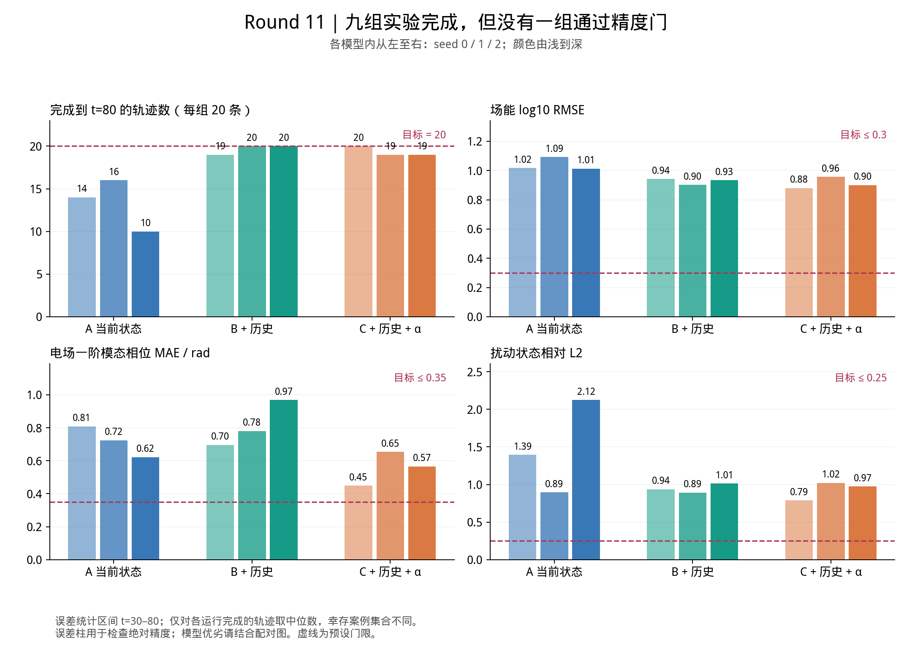
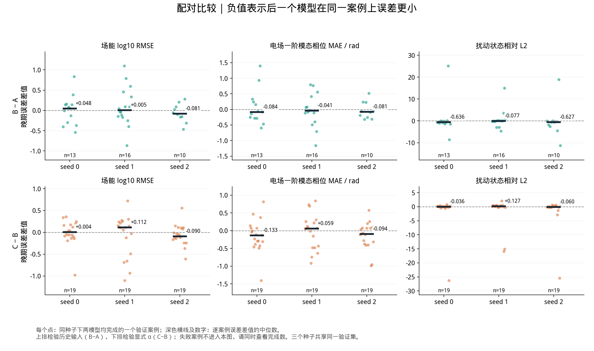
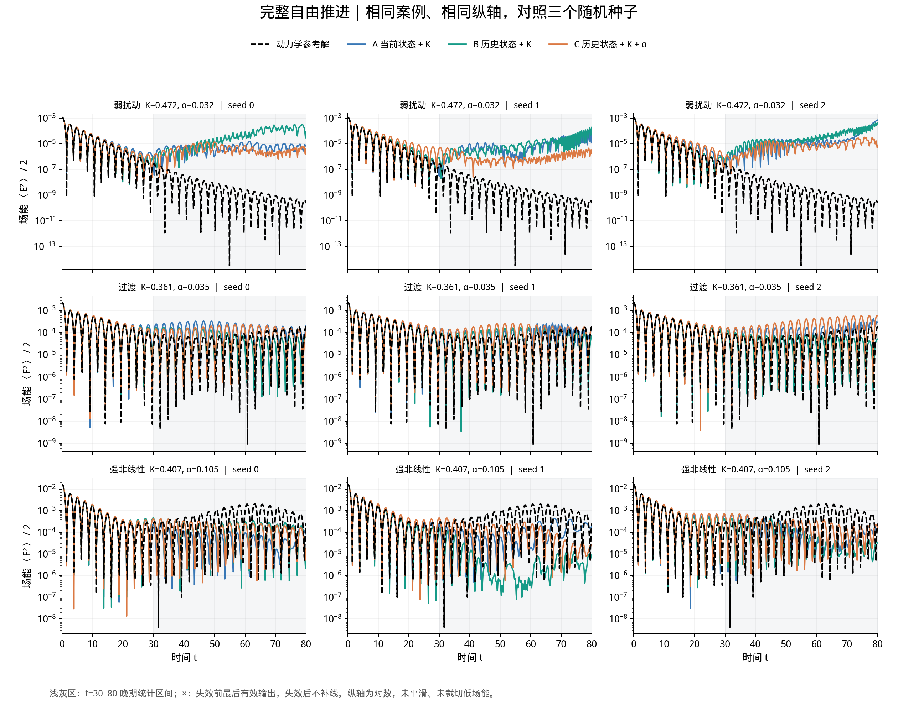
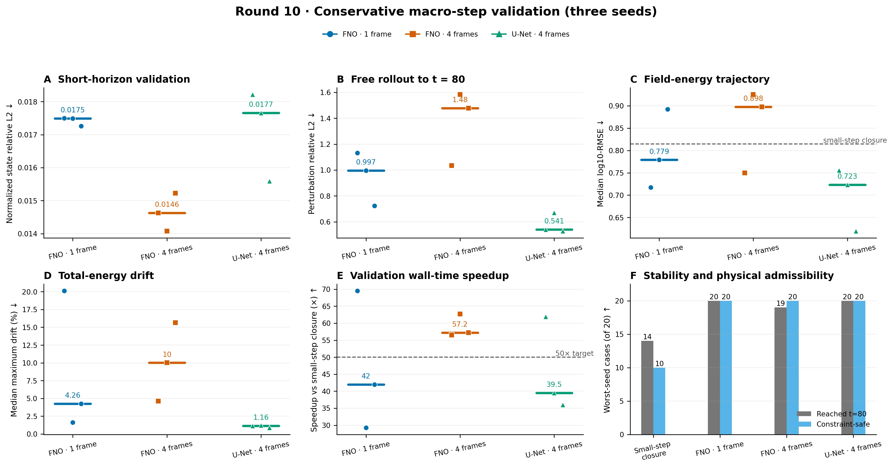
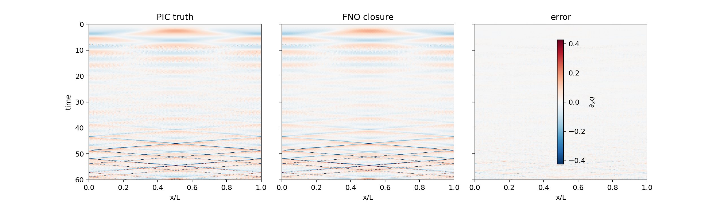
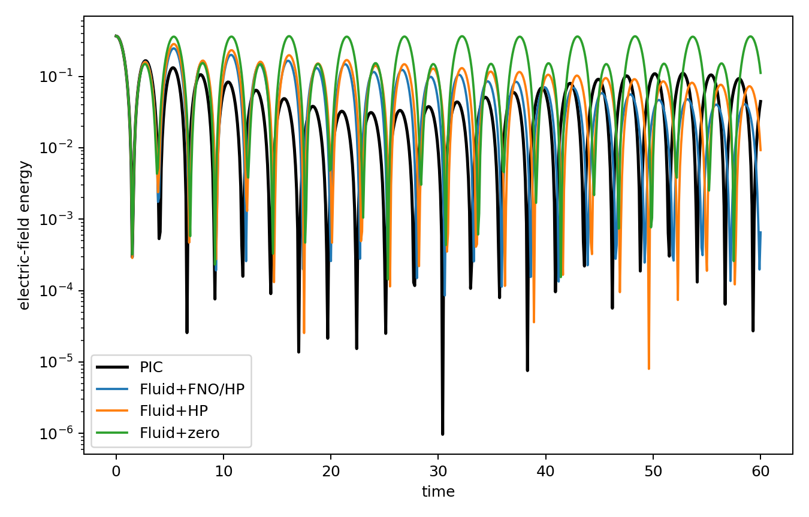

# 关键结果与看图指南

本页对应 **2026-09-09 公开结果快照**。不需要服务器或 GPU，直接在 GitHub 上看图即可。
想运行模型时再读[checkpoint 下载与使用指南](CHECKPOINTS_zh-CN.md)；
尚不熟悉背景时先看[新成员学习路线](../onboarding/README.md)。

## 1. 先看什么

| 研究阶段 | 这次公开的内容 | 应当记住的结论 |
|---|---|---|
| 旧版 x-v Snapshot / Rollout | 两个冻结 checkpoint 与模型卡 | 可运行的分布预测基线；主要验证范围为 t=0..15 |
| PIC 热流闭合 v1 | 模型、部署参数、八张图、指标汇总 | 离线闭合精度改善；长期部署使用 25% FNO + 75% HP，仍有明显轨迹误差 |
| Gkeyll 瞬时闭合基线 | 作为 Round 11 初始化来源的 seed 1 checkpoint | 研究基线，不能只凭闭合误差推断长期准确 |
| Round 10 宏步预测 | 三种模型的既有代表 checkpoint、全种子验证汇总与旧测试结果 | 短窗收益没有一致转化为长期场能收益；计时优势不能单独证明任务达标 |
| Round 11 历史闭合 | A/B/C 全部九个选定 checkpoint、全部逐案例指标、配对图和全案例 PDF | 历史提高完成率，但九组均未通过精度门；未进入加速或新盲测 |

各行使用不同的数据、目标、时间范围和指标。不能把它们的误差数字排成一张统一“排行榜”。
下面先看最新的 Round 11，再理解之前的基线。

## 2. Round 11：完成实验，不等于完成研究目标

网络 A 读当前状态，B 加入历史，C 在历史之外再加入初始 alpha。
所有组都输入 K，使用相同主干和数值设置。每组的三个种子共享既有监督初始化。

**看法：**左上是 20 条 validation 轨迹中完成 t=80 的数量；其余三幅是 t=30..80 的误差。
虚线是预定工程门限。误差越小越好，完成数越大越好，但两者都必须达标。

| 输入 | seed 0 / 1 / 2 完成数 | 场能 log10-RMSE 中位数范围 | 最终质量门 |
|---|---|---|---|
| A：当前状态 + K | 14 / 16 / 10（每次共 20） | 1.013–1.092 | 三次均失败 |
| B：历史状态 + K | 19 / 20 / 20 | 0.902–0.942 | 三次均失败 |
| C：历史状态 + K + alpha | 20 / 19 / 19 | 0.880–0.956 | 三次均失败 |

表中误差是**各运行完成案例**的中位数，幸存集合不同。该表用于检查绝对精度和完成率，
不能仅凭范围大小给模型排名。场能门限为 0.3，晚期扰动相对 L2 门限为 0.25。
原始数字见[完整汇总 JSON](../../results/published/2026-09-09/round11/summary.json)、
[九组运行 CSV](../../results/published/2026-09-09/round11/run_metrics.csv)和
[180 条逐案例记录](../../results/published/2026-09-09/round11/case_metrics.csv)。
CSV 中失败案例的晚期误差留空，绝不是误差为零。

### 同一案例上的配对比较

每个点是两模型都完成的同一个案例；横线是逐案例差值的中位数。
上排为 B−A，检查历史输入；下排为 C−B，检查显式 alpha。
负数表示 B（上排）或 C（下排）的误差更小。
不同种子使用同一验证集，不能把这些点当成全新的独立数据集。

三个种子中，B−A 的配对晚期扰动误差中位数分别约为 −0.636、−0.077、−0.627。
它支持继续研究历史输入，但仍不足以达到当前精度目标。
C−B 的配对场能差值约为 +0.0039、+0.1122、−0.0899，显式 alpha 的收益不一致。
配对数据见[CSV](../../results/published/2026-09-09/round11/paired_metrics.csv)。

### 误差在时间上怎样出现

黑虚线是动力学参考，蓝/绿/橙分别为 A/B/C。每行使用相同案例和纵轴，每列是一个种子。
灰色区间是晚期评价范围。失效后不续画预测曲线，也不以零或最后一个值补齐。

弱扰动案例中，参考场能继续降低，而预测出现较高的平台或再增长；
强非线性案例中，预测与参考的反弹幅度、演化形态也存在差异。
因此“曲线一直画到右端”与“预测正确”需要分开判断。
这些案例按各物理类别内的 `(K,alpha)` 排序后取中间位置，选择不依赖模型误差。

还有[全部 20 个案例的 PDF](../../results/published/2026-09-09/round11/figures/04_all_20_cases.pdf)，
无需下载完整数值轨迹即可逐案例查看。
完整解释见[正式执行记录](../experiments/LANDAU_CLOSURE_ROUND11_EXECUTION_2026-09-07_zh-CN.md)。

### 数值链路和终止条件

真实热流驱动的 oracle 在全部 20 条 validation 上完成 t=80，
相对未滤波矩场的最大扰动误差约 0.812%。这支持所检查的数值链路，
不证明网络能从低阶状态推断出相同闭合。
参见[正式 oracle 门记录](../../results/published/2026-09-09/round11/oracle_gate_formal_mode16.json)。

由于九组都未通过，后续控制器记录了
[`complete_negative_accuracy_result`](../../results/published/2026-09-09/round11/postquality_status.json)。
**这次发布没有新增盲测结果，也没有 Round 11 同精度加速结论。**
发布这些 checkpoint 是为了复查和改进，不能将它们称为已达标的最终部署模型。

## 3. Round 10：短窗拟合与长期预测的区别

Round 10 直接预测原始矩场 `[M0,M1,M2,E]` 的宏步增量。
它与 Round 11 的 `dq/dx` 闭合不是同一种输出，历史初始化方式也不同。

图 A 显示加入历史的 FNO 改善了短窗口拟合；图 B/C 则表明长期扰动与场能误差没有同步改善。
必须同时看守恒、完成率和误差。图内的计时比来自历史共享 GPU 实验，并非所有方法都达到相同精度或完成率；
图 E 的 50× 是旧绘图参考线，阶段要求应以[Round 10 协议](../experiments/LANDAU_MACROSTEP_ROUND10_PROTOCOL_zh-CN.md)为准。

三种代表 checkpoint 是之前依据 validation 确定、已经用于 diagnostic test 的版本，
本次发布没有重新从测试结果挑选权重。

| 既有代表 | 旧 diagnostic test 完成数 | 场能 log10-RMSE 中位数 | 扰动相对 L2 中位数 |
|---|---:|---:|---:|
| 单帧 FNO，seed 1 | 36/36 | 0.8630 | 0.8146 |
| 四帧 FNO，seed 2 | 36/36 | 0.9756 | 1.6699 |
| 四帧 U-Net，seed 1 | 36/36 | 0.8118 | 0.6590 |

这是已打开的旧测试集，不能称为新盲测。宏步 rollout 使用 1 或 4 个真实起始帧，之后不回灌真值；
不要与 Round 11 从单一初态构造缺失历史的实验混称。
完整三种子验证见[JSON](../../results/published/2026-09-09/round10/validation_summary.json)，
旧测试逐案例结果在[Round 10 目录](../../results/published/2026-09-09/round10/)。

想看轨迹形状，可打开[验证代表曲线](../../results/published/2026-09-09/round10/figures/round10_representative_rollouts.png)、
[强非线性旧测试图谱](../../results/published/2026-09-09/round10/figures/strong_nonlinear_field_energy_atlas.png)和
[误差矩阵](../../results/published/2026-09-09/round10/figures/strong_nonlinear_error_matrix.png)。

## 4. PIC 闭合 v1：离线精度与部署混合的取舍

该分支从 60 条 CUDA-PIC 案例中构造标签，使用按参数组划分的训练/验证/测试集合。
同一参数的三粒子种子平均用于降低高阶矩噪声。这里网络预测 `q` 后求导，
不是 Round 11 的历史输入直接预测 `dq/dx`。

这幅图展示代表参数 `k=0.35, alpha=0.10` 的离线闭合比较：横轴时间，纵轴 `x/L`。
参考与预测共用色标，误差使用独立色标。色标范围由 99.5% 分位数设定，
因此最极端值可能饱和；精确误差请读指标，不能只凭颜色相近下结论。

纯 FNO 的测试闭合相对 L2 约 0.3086，校准 HP 为 0.9849。
但长期自由推进中，纯 FNO 不对所有案例稳定；既有部署使用 **25% FNO + 75% HP**，
其闭合误差约 0.7701，不能把纯 FNO 的 0.3086 标在混合部署模型上。

黑线为 PIC，蓝线为混合部署，橙线为 HP，绿线为零热流闭合。
五个测试参数组的混合 rollout 均到 t=60 且没有密度/压力钳制，但场能误差仍然明显：
汇总 log10-RMSE 约 1.3080，HP 约 1.6273。
历史观测速度比约 1.21×，属于共享 GPU 的特定计时，不是普遍或同精度加速保证。
数据见[研究汇总](../../results/published/2026-09-09/pic_closure_v1/study_summary.json)与
[模型卡](../../models/closure/MODEL_CARD.md)。

其余图可从[图片目录](../../results/published/2026-09-09/pic_closure_v1/figures/)查看，
包括矩场、逐参数误差、总能量变化和 PIC 相空间演化。
相空间图来自参考模拟，不是低阶闭合模型重建的完整分布；
总能量图的旧图例 `Fluid+FNO` 实际对应这组混合运行，应结合部署配置理解。

## 5. 旧版分布模型：适合第一次跑通推理

Snapshot 直接预测给定参数和时间的相空间扰动，Rollout 则递归预测完整网格场。
冻结记录中的测试 case-macro 相对 L2 约为 0.2060 和 0.2241。
这些是旧数据与旧评价口径，不能与上面的矩场误差直接比较。

模型卡：[Snapshot](../../results/published/2026-09-09/legacy/snapshot_model_card.json)、
[最终 positivity Rollout](../../results/published/2026-09-09/legacy/positivity_model_card.json)。
第一次动手可只下载 Snapshot：它自带推理所需网格与尺度，不要求下载训练集。
具体命令见[checkpoint 指南](CHECKPOINTS_zh-CN.md)。

## 6. 怎样追溯与复现图表

- 本次选取的原图和 JSON 都按原始字节保存，来源路径、大小与 SHA256 见[来源清单](../../results/published/2026-09-09/provenance.json)。
- Round 11 的 CSV 从完整汇总导出，保留全部九次运行和全部 180 条案例记录；缺失误差不填零。
- 原始结果目录仍在共享服务器，完整预测轨迹和训练数据没有并入 Git。原 JSON 中的绝对路径保留作历史来源记录。
- Round 11 图由 [plot_round11_formal_review.py](../../scripts/plot_round11_formal_review.py)生成。重新绘图需共享的九份选定 rollout 数组和中文字体 `WenQuanYi Micro Hei`；只浏览公开 PNG/PDF 不需要这些依赖。
- 公开快照固定在 `results/published/2026-09-09/`，未来结果应新增版本，不能覆盖本次证据。

阅读一幅图时，先确认模型输出、数据划分、时间范围、完成集合与计时范围，再解释曲线好坏。
